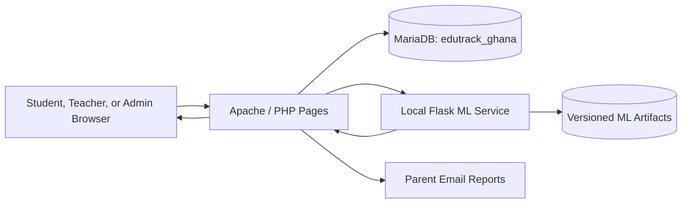
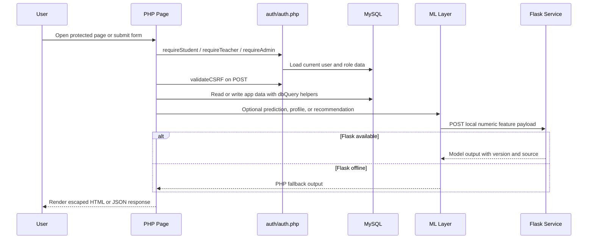
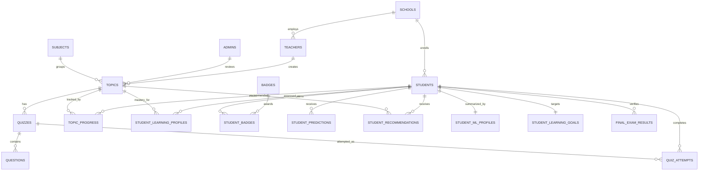
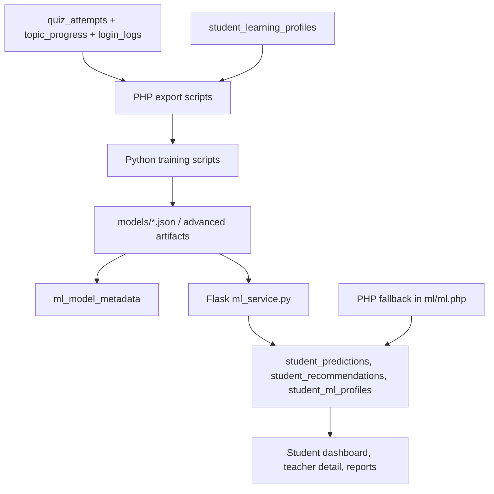
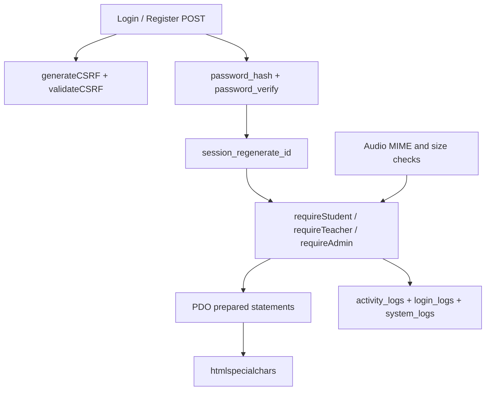

# EduTrack Ghana Codebase, Database, Security, and ML Guide

Last updated: June 25, 2026

This guide is written for the next developer, administrator, or reviewer who needs to understand how EduTrack Ghana is built, how the database is organized, where the security controls live, and what each machine-learning component means in the system.

EduTrack is a PHP and MySQL learning platform for Ghanaian junior high schools. Runtime web pages are served by Apache/XAMPP, data is stored in MariaDB/MySQL, and optional machine-learning inference is provided by a local Flask service with PHP fallbacks.

## System Overview



The PHP application remains usable when the Flask ML service is offline. In that case, `ml/ml.php` uses database features and local JSON artifacts to return guarded predictions and recommendations.

## Repository Map

| Path | Purpose |
|---|---|
| `index.php` | Public landing page. |
| `config/db.php` | Primary PDO database configuration and query helpers. |
| `config.php` | Legacy MySQLi compatibility connection for older admin and maintenance pages. |
| `auth/` | Login, registration, logout, session guards, validation, CSRF, password logic. |
| `student/` | Student dashboards, topics, quizzes, progress, badges, accessibility, reports. |
| `teacher/` | Teacher dashboards, topic/quiz creation, analytics, student reports, announcements. |
| `admin/` | Admin dashboards, account moderation, subjects, topics, violations, logs. |
| `api/` | JSON endpoints for ML bridge, recent teacher activity, and audio transcription. |
| `includes/` | Shared header/footer, system-log helper, question-quality validator. |
| `ml/` | PHP ML client/fallbacks, Flask service, training exporters, training scripts, model registration. |
| `database/` | Migrations, data audits, and demo seed scripts. |
| `docs/` | Project documentation and ML implementation notes. |
| `tests/php/run.php` | Focused PHP regression checks for auth, validation, CSRF, and ML safety. |
| `edutrack_ghana.sql` | Main database dump and seed data. |

## Runtime Request Flow



## Code Clusters

### Configuration and Database Access

| File | Important functions | What it does |
|---|---|---|
| `config/db.php` | `getDB`, `dbQuery`, `dbRow`, `dbRows`, `dbValue`, `dbInsert` | Central PDO access layer. All new runtime code should use these helpers. PDO errors throw exceptions, default fetch mode is associative arrays, and emulated prepares are disabled. |
| `config.php` | `$conn` legacy MySQLi connection | Kept for compatibility with legacy admin and maintenance utilities. New code should prefer `config/db.php`. |
| `config/.htaccess` | Apache rule | Denies direct web access to configuration files. |

### Authentication, Session, and Account Logic

| File | Important functions | What it does |
|---|---|---|
| `auth/auth.php` | `isLoggedIn`, `isStudent`, `isTeacher`, `isAdmin` | Reads session role state. |
| `auth/auth.php` | `requireStudent`, `requireTeacher`, `requireAdmin`, `requireLogin` | Redirects unauthorized users before protected page logic runs. |
| `auth/auth.php` | `getCurrentUser` | Loads the active account from `students`, `teachers`, or `admins`. |
| `auth/auth.php` | `validateEmail`, `validatePassword`, `validatePhoneNumber`, `teacherDisplayName`, `sanitize` | Shared validation and display helpers. |
| `auth/auth.php` | `generateCSRF`, `validateCSRF` | Creates a 32-byte session CSRF token and validates with `hash_equals`. |
| `auth/auth.php` | `registerStudent`, `registerTeacher` | Validates registration input, checks school/subject records, hashes passwords, generates public IDs, and logs activity. |
| `auth/auth.php` | `loginUser`, `logoutUser` | Verifies passwords, checks account activation, regenerates session IDs, writes login/activity logs, and updates student streaks. |
| `auth/auth.php` | `logActivity`, `updateStreak` | Writes audit trail rows and maintains daily learning streaks. |
| `auth/login.php` | page controller | Login form and POST handler. |
| `auth/register.php` | page controller | Student/teacher registration form and POST handler. |
| `auth/logout.php` | page controller | Ends active session. |
| `auth/hash.php` | dev utility | Generates an admin password hash. Treat as development-only and do not expose publicly. |

### Student Learning Cluster

| File | Important functions | What it does |
|---|---|---|
| `student/student.php` | `getStudentStats` | Dashboard counts, averages, badges, recent quizzes. |
| `student/student.php` | `getSubjectsWithProgress`, `getTopicsForSubject` | Subject/topic lists filtered by class level, school, approval status, and progress. |
| `student/student.php` | `startTopic`, `completeTopic` | Starts/completes topic progress, awards points, logs activity, and protects against duplicate completion rewards. |
| `student/student.php` | `getAvailableQuizzes` | Lists active quizzes visible to the student's class and school. |
| `student/student.php` | `getAdaptiveQuizQuestions` | Selects personalized quiz questions using mastery, prior mistakes, difficulty, Bloom level, and deterministic student-specific ordering. |
| `student/student.php` | `startQuizAttempt` | Creates a quiz attempt and stores the exact selected question IDs for fair scoring. |
| `student/student.php` | `submitQuizAttempt` | Scores answers, prevents duplicate rewards on retry, writes results JSON, refreshes mastery, awards points/badges, and refreshes ML outputs. |
| `student/student.php` | `awardPoints`, `checkAndAwardBadges` | Gamification and badge-award rules. |
| `student/student.php` | `getLearningPreferenceGuide`, `getSubjectStudyTips`, `generateRecommendations` | Rule-based study guidance used as fallback or display enrichment. |
| `student/student.php` | `getProgressOverview` | Progress charts and score history. |
| `student/dashboard.php` | page controller | Student home, ML forecast, recommendations, learning goal update, announcements. |
| `student/quizzes.php` | page controller | Starts and renders quiz attempts. |
| `student/quiz_result.php` | page controller | Shows scored attempt and explanations. |
| `student/topic.php` | page controller | Displays lesson content and available quizzes. |
| `student/progress.php`, `student/badges.php`, `student/leaderboard.php` | page controllers | Learner progress, rewards, and rankings. |
| `student/accessibility.php` | page controller | Voice accessibility UI using transcription endpoint. |
| `student/report_violation.php` | page controller | Student violation reports. |
| `student/mark_announcement_seen.php` | endpoint | Marks pinned/active announcements as seen after CSRF validation. |

### Teacher Cluster

| File | Important functions | What it does |
|---|---|---|
| `teacher/teacher.php` | `getTeacherStats` | Teacher dashboard totals, active students, weekly attempts, top students, activity. General teachers see school-wide data; specialists see subject-scoped data. |
| `teacher/teacher.php` | `getAllStudentsDetailedForSchool`, `getAllStudentsDetailed` | Student lists with quiz, topic, badge, and score aggregates. |
| `teacher/teacher.php` | `getStudentDetailForTeacher` | Student profile, quizzes, subject scores, badges, restricted by school when supplied. |
| `teacher/teacher.php` | `getSchoolAnalytics` | Subject pass rates, score distribution, monthly activity, class performance. |
| `teacher/teacher.php` | `generateStudentReport` | Builds printable/email-ready report data and includes the guarded exam forecast. |
| `teacher/topics.php` | page controller | Teacher-created topics, usually pending admin approval. |
| `teacher/create_quiz.php` | page controller | Quiz and question authoring for approved topics. Uses question quality checks. |
| `teacher/reports.php` | page controller | Progress report generation, remarks, and parent email sending. |
| `teacher/report_email_template.php` | `reportEmailEscape`, `buildReportEmailHtml` | Email-safe report HTML and forecast block. |
| `teacher/analytics.php`, `teacher/students.php`, `teacher/student_detail.php` | page controllers | Analytics and student drill-down views. |
| `teacher/announcements.php` | page controller | Teacher announcements and scheduling. |
| `teacher/violations.php` | page controller | Teacher view of school violation reports. |

### Admin Cluster

| File | What it does |
|---|---|
| `admin/dashboard.php` | Admin home, school summary, pending violations, recent system logs. |
| `admin/_layout.php` | Shared admin header/footer rendering. |
| `admin/students.php` | Search, activate/deactivate, reset password, delete students. |
| `admin/teachers.php` | Approve/deactivate/delete teacher accounts. |
| `admin/subjects.php` | Subject CRUD. |
| `admin/topics.php` | Review, approve, reject, activate, deactivate, and create curriculum topics. |
| `admin/announcements.php` | School-wide announcements. |
| `admin/violations.php` | Moderates violation-report status. |
| `admin/logs.php` | Searchable system logs. |
| `admin/generate_report.php` | Legacy admin student report page. |

### API Cluster

| Endpoint file | Auth requirement | Purpose |
|---|---|---|
| `api/ml_bridge.php` | Logged in; student/teacher/admin checks | JSON bridge for ML health, predictions, and learner-owned recommendations. Teachers are restricted to students in their school. |
| `api/transcribe.php` | `requireLogin` | Validates uploaded audio type/size and forwards it to Flask `/api/v1/transcribe`. |
| `api/teacher_recent_activity.php` | `requireTeacher` | Returns teacher dashboard recent student activity. |

### Curriculum, Quality, and Maintenance

| File | Purpose |
|---|---|
| `includes/question_quality.php` | `assessQuestionQuality` validates MCQ wording against Basic 7-9/Bloom expectations and returns blocking errors plus review warnings. |
| `docs/GES_MCQ_AUTHORING_STANDARD.md` | Human-readable MCQ authoring standard. |
| `database/audit_question_quality.php` | Audits stored questions against the quality standard. |
| `seed_full_jhs_curriculum.php`, `localize_french_curriculum.php`, `localize_twi_curriculum.php` | Curriculum seed/localization utilities. |
| `database/seed_ezra_demo_data.php`, `database/seed_defense_demo_data.php` | Demo data scripts for testing reports, ML, and defense scenarios. |

## Database Architecture

The base dump `edutrack_ghana.sql` defines the core platform tables. Migrations in `database/migrations/` add the ML and learning-goal tables. In a fresh setup, import the base dump, then apply both migrations.



### Table Clusters

| Cluster | Tables | Purpose |
|---|---|---|
| Identity and schools | `schools`, `students`, `teachers`, `admins` | Account records, school ownership, class level, login counters, activation state. |
| Curriculum | `subjects`, `topics`, `quizzes`, `questions` | Learning content, teacher-created topics, quiz configuration, MCQ options, Bloom levels. |
| Learning activity | `topic_progress`, `quiz_attempts`, `student_learning_profiles` | Topic completion, exact quiz attempts, answer JSON, mastery per student/topic. |
| Rewards | `badges`, `student_badges` | Badge criteria and earned rewards. |
| Communication/reporting | `announcements`, `announcement_views`, `student_report_remarks`, `violation_reports` | Announcements, read tracking, teacher remarks, student reports, violations. |
| Audit and security | `activity_logs`, `login_logs`, `system_logs`, `password_reset_tokens` | Login/activity traces, admin actions, reset-token hashes. |
| ML and personalization | `ml_model_metadata`, `student_predictions`, `student_recommendations`, `final_exam_results`, `student_ml_profiles`, `student_learning_goals` | Versioned model metadata, cached forecasts, cached recommendations, verified labels, learner segments, target mastery. |

### Core Table Reference

| Table | Key columns and constraints | Notes |
|---|---|---|
| `schools` | `id`, `name`, `region`, `district` | Parent table for students and teachers. |
| `students` | unique `email`, `school_id`, `teacher_id`, `student_id`, `class_level`, `learning_style`, `difficulty_level`, `parent_phone` check | Main learner profile. Tracks points, streaks, activity, activation, parent contact, and password hash. |
| `teachers` | unique `email`, `school_id`, `subject`, `staff_id`, `is_active` | Teacher accounts require admin approval when registered through `registerTeacher`. |
| `admins` | unique `email`, `password` | Admin passwords are stored in a separate `password` column, while student/teacher hashes use `password_hash`. |
| `subjects` | `name`, `code`, `class_level` | Subject catalog. |
| `topics` | `subject_id`, optional `school_id`, optional `created_by_teacher_id`, `approval_status`, `is_active` | Topic visibility is controlled by class, school, active state, and approval. |
| `quizzes` | `teacher_id`, `topic_id`, `time_limit_minutes`, `pass_score`, `max_attempts`, `is_active` | Quiz metadata. |
| `questions` | `quiz_id`, four options, `correct_answer`, `difficulty`, `bloom_level` | MCQ bank. Bloom values are `remember`, `understand`, `apply`, `analyze`, `evaluate`, `create`. |
| `quiz_attempts` | `student_id`, `quiz_id`, `score`, `answers_json`, `question_ids_json`, `started_at`, `completed_at` | Stores selected question IDs so adaptive attempts are scored against the exact delivered set. |
| `topic_progress` | unique `(student_id, topic_id)`, `status`, `completion_percent` | Prevents duplicate topic rows and supports progress views. |
| `student_learning_profiles` | unique `(student_id, topic_id)`, `mastery_level`, `attempts`, `last_assessed` | Topic mastery cache refreshed after completed quizzes. |
| `badges` | `criteria_type`, `criteria_value`, `points_reward` | Badge rules are interpreted by `checkAndAwardBadges`. |
| `student_badges` | unique `(student_id, badge_id)` | Duplicate badge prevention. |
| `announcements` | `teacher_id`, `target`, `is_pinned`, `scheduled_at`, `expires_at`, `is_active` | Admin and teacher announcements. |
| `announcement_views` | unique `(student_id, announcement_id)`, `seen_version` | Tracks whether a student has seen the current announcement version. |
| `student_report_remarks` | unique `(teacher_id, student_id, academic_year, term)` | Teacher report remarks and attendance fields. |
| `violation_reports` | `student_id`, `violation_type`, `status`, `is_anonymous` | Student-reported violations. |
| `activity_logs` | `user_id`, `user_type`, `action`, `details`, `ip_address` | General user activity, mostly student/teacher actions. |
| `login_logs` | `user_id`, `user_type`, `login_time`, `ip_address` | Login activity used for analytics. |
| `system_logs` | `user_name`, `action` | Admin-oriented action log. |
| `password_reset_tokens` | unique `token_hash`, `expires_at`, `used_at` | Stores token hashes, not raw reset tokens. |

### ML Table Reference

| Table | Purpose |
|---|---|
| `ml_model_metadata` | Registry of active and historical model versions, algorithm names, feature lists, metrics, artifact path, and training sample counts. |
| `student_predictions` | One cached forecast per student and prediction type. Stores predicted score/grade, confidence, risk level, explainable factors JSON, model version, and generated time. |
| `student_recommendations` | Cached ranked topic recommendations per student/topic with score, reason, explanation JSON, and model version. |
| `final_exam_results` | Verified final-exam outcomes used to strengthen supervised training when available. |
| `student_ml_profiles` | Learner segment and optional neural embedding from the profile model. |
| `student_learning_goals` | Per-student target mastery, defaulting to 70 percent when no row exists. |

## Machine Learning Components

EduTrack uses ML as a support layer, not as the source of truth for learning records. Core quiz scoring, progress, badges, and reports are stored in MySQL and continue without ML inference.



### ML File Map

| File | Meaning |
|---|---|
| `ml/client.php` | Small HTTP client for the local Flask service. Reads `EDUTRACK_ML_URL` or defaults to `http://127.0.0.1:5000`. |
| `ml/ml.php` | PHP ML feature extraction, prediction fallback, recommendation fallback, learner-profile fallback, cache persistence, model metadata registration. |
| `api/ml_bridge.php` | Authenticated JSON bridge used by the web app to request health, prediction, and recommendation data. |
| `ml/ml_service.py` | Flask service exposing `/api/v1/health`, `/api/v1/predict`, `/api/v1/profile`, `/api/v1/recommendations`, and `/api/v1/transcribe`. |
| `ml/export_training_data.php` | Exports temporal training samples for baseline score prediction. |
| `ml/train_model.py` | Trains a standard-library ridge linear regression model and writes `models/exam_predictor.json`. |
| `ml/register_model.php` | Registers the baseline model artifact in `ml_model_metadata`. |
| `ml/export_advanced_training_data.php` | Exports profile samples, bandit events, prediction samples, and topic catalog for advanced training. |
| `ml/train_learner_profile.py` | Trains TensorFlow autoencoder embeddings and KMeans learner segments. |
| `ml/train_bandit.py` | Trains TensorFlow offline contextual-bandit reward ranking. |
| `ml/train_xgboost.py` | Trains XGBoost score regression and risk classification. |
| `ml/train_advanced_models.py` | Runs the three advanced training scripts. |
| `ml/register_advanced_models.php` | Registers advanced TensorFlow, XGBoost, and Whisper metadata. |
| `ml/prepare_whisper_dataset.py` | Validates a consented audio manifest and creates speaker-separated training/validation splits. |
| `ml/fine_tune_whisper.py` | Fine-tunes Whisper only when the prepared dataset has at least 500 recordings from at least 20 speakers. |
| `api/transcribe.php` and `student/accessibility.php` | Web bridge and UI for voice transcription. |

### ML Features

| Feature | Meaning | Produced from |
|---|---|---|
| `attempt_count` | Number of completed quiz attempts. | `quiz_attempts` |
| `avg_score` | Average score across all completed attempts. | `quiz_attempts.score` |
| `recent_avg` | Average of the last three quiz scores. | chronological `quiz_attempts` |
| `trend` | Recent average minus previous comparison window. Positive means improving. | chronological `quiz_attempts` |
| `pass_rate` | Percent of completed attempts passed. | `quiz_attempts.passed` |
| `attempt_count_log` | Log-scaled practice volume to reduce extreme-count effects. | computed |
| `avg_time_minutes` | Average valid attempt time in minutes, capped at 60. | `quiz_attempts.time_taken_seconds` |
| `mastery` | Average topic mastery as a percent. | `student_learning_profiles.mastery_level` |
| `topic_completion` | Average completion across visible approved topics. | `topic_progress` plus `topics` |
| `login_count_log` | Log-scaled platform activity. | `students.login_count` |
| `current_streak` | Current streak capped at 30. | `students.current_streak` |

### ML Algorithms and Their Roles

| Component | Algorithm | What it means in EduTrack |
|---|---|---|
| Baseline exam predictor | Ridge linear regression trained by gradient descent | Produces a bounded score forecast from engagement, mastery, and quiz history. It is explainable because feature weights can be converted into factor effects. |
| Personal trend fallback | Per-student linear trend | Used when no trained artifact is available but the learner has enough evidence. It blends recent average, overall average, and projected personal trend. |
| Advanced score/risk prediction | XGBoost regressor and binary classifier | Predicts future assessed score and high-risk status from the same learning features. Current docs describe it as prototype unless verified exam labels are sufficient. |
| Learner profile | TensorFlow dense autoencoder plus KMeans | Compresses numeric learning behavior into an embedding and maps learners to segments: `needs_support`, `developing`, `improving`, or `mastering`. |
| Recommendation ranker | TensorFlow offline contextual-bandit reward model | Scores topic candidates by expected learning reward using learner context plus topic action features. |
| Recommendation fallback | PHP weighted rule score | Uses mastery gap, learning goal gap, progress status, low quiz scores, difficulty fit, and risk level when Flask or advanced models are unavailable. |
| Speech accessibility | OpenAI Whisper pretrained multilingual model | Transcribes recorded learner audio locally through Flask. The fine-tuning pipeline exists, but the project must not claim Ghanaian-accent fine-tuning until a trained checkpoint and evaluation exist. |

### ML Guardrails

- Forecasts are guarded by evidence checks. The PHP code currently uses `EDUTRACK_PERSONAL_FORECAST_MINIMUM = 5` for personal forecasts; the Flask model also reads the artifact `minimum_attempts` and may require either 10 attempts or 10 percent topic completion for stronger service forecasts.
- New learners receive `risk_level = insufficient_data`, not a failing prediction.
- Scores are bounded to 0-100.
- Every available forecast includes confidence, risk level, factors, model version, and inference source.
- Cached predictions and recommendations expire after `EDUTRACK_ML_CACHE_SECONDS` which is currently 86,400 seconds.
- Quiz completion catches ML exceptions so learning workflow is not blocked by a model outage.
- `final_exam_results` is the correct place to add verified labels for future model validation.

## Security Code Map



| Control | Location | Notes |
|---|---|---|
| Password hashing | `auth/auth.php`, `admin/students.php`, seed scripts | Student and teacher accounts use `password_hash`; login uses `password_verify`. Admin reset uses `PASSWORD_DEFAULT`; registration uses `PASSWORD_BCRYPT`. |
| Session fixation protection | `loginUser`, `logoutUser` | Calls `session_regenerate_id(true)` after login and logout reset. |
| Role authorization | `requireStudent`, `requireTeacher`, `requireAdmin`, `requireLogin` | Protected pages call these near the top. New protected pages should do the same before data access. |
| CSRF protection | `generateCSRF`, `validateCSRF` | POST forms include a hidden token. Validation uses `hash_equals`. |
| SQL injection protection | `dbQuery` and related helpers | Runtime queries use prepared statements with parameters. Avoid dynamic SQL except for controlled table names/clauses. |
| Output escaping | Most PHP views via `htmlspecialchars`; email via `reportEmailEscape` | User-controlled strings should be escaped before HTML output. |
| Account activation | `students.is_active`, `teachers.is_active`, `loginUser` | Inactive non-admin accounts cannot log in. Teachers registered publicly start inactive. |
| Teacher data boundary | Teacher pages and `api/ml_bridge.php` | Teachers are restricted to students in their own school; specialist teachers are subject-scoped in analytics. |
| Topic publishing boundary | `topics.approval_status`, `topics.is_active`, admin topic review | Student views only show approved active topics visible to class/school. |
| Audio upload validation | `api/transcribe.php`, `ml/ml_service.py` | Requires login, max 15 MB, MIME/extension allow-lists, Flask max content length. |
| Config protection | `config/.htaccess`, `.gitignore` | Apache denies config folder access; `/config/.env` is ignored by Git. |
| Audit logs | `activity_logs`, `login_logs`, `system_logs` | Login, registration, quiz, topic, admin, and report actions are recorded. |
| Reset token storage | `password_reset_tokens` | Schema stores a SHA-256-sized token hash, expiry, and used timestamp. |

## Important Workflows

### Student Quiz Attempt

1. Student opens `student/quizzes.php`.
2. `requireStudent` verifies role.
3. POST start validates CSRF.
4. `startQuizAttempt` verifies quiz visibility and max attempts.
5. `getAdaptiveQuizQuestions` selects questions from the topic pool.
6. `quiz_attempts.question_ids_json` stores delivered question IDs.
7. Student submits answers.
8. `submitQuizAttempt` scores only stored question IDs, writes `answers_json`, awards points/badges, updates mastery, logs activity, and refreshes ML caches.

### Teacher Report

1. Teacher opens `teacher/reports.php`.
2. `requireTeacher` verifies role and page filters students by school.
3. `generateStudentReport` gathers student details, quiz history, subject strengths/weaknesses, badges, and ML forecast.
4. Report remarks are upserted into `student_report_remarks`.
5. Optional email uses `teacher/report_email_template.php`.

### ML Retraining

Baseline:

```powershell
C:\xampp\php\php.exe ml\export_training_data.php
python ml\train_model.py
C:\xampp\php\php.exe ml\register_model.php
```

Advanced:

```powershell
C:\xampp\php\php.exe ml\export_advanced_training_data.php
ml\.venv\Scripts\python.exe ml\train_advanced_models.py
C:\xampp\php\php.exe ml\register_advanced_models.php
```

Run Flask:

```powershell
cd C:\xampp\htdocs\edutrack\ml
python ml_service.py
```

## Readability and Maintenance Rules

- Start every protected page with the appropriate `require...` guard.
- Validate CSRF before every state-changing POST.
- Use `dbQuery`, `dbRow`, `dbRows`, `dbValue`, and `dbInsert` for database access.
- Keep business logic in cluster modules such as `student/student.php`, `teacher/teacher.php`, `auth/auth.php`, and `ml/ml.php`; keep page files focused on request handling and rendering.
- Store generated or delivered quiz state, such as selected question IDs, before showing it to the learner.
- Use `ON DUPLICATE KEY UPDATE` or unique keys for cache-like data that should have one row per student/topic/model.
- Escape all values at render time with `htmlspecialchars` unless they are trusted constants or intentionally rendered HTML.
- Keep ML outputs explainable by returning model version, inference source, confidence, and factor names.
- Do not present prototype ML outputs as final exam results. They are planning forecasts.
- Avoid committing generated training data, virtual environments, vendor folders, or real student data exports.

## Known Cleanup Notes

- Some older content strings and documentation contain mojibake from an encoding conversion, for example smart quotes rendered as broken replacement sequences. Repair these with a UTF-8 source pass before public publication.
- `auth/hash.php` should remain a development utility only. In production, remove it or block web access.
- `config/db.php` uses local XAMPP credentials (`root` with empty password). Production must use environment-specific credentials, HTTPS, restricted PHP error output, and least-privilege database users.
- The README says forecasts require at least three completed quizzes, while the current PHP guard uses five for personal forecasts. Keep user-facing copy, tests, and ML constants aligned when this policy is finalized.
- The SQL dump contains seed/demo data. Do not share a dump containing real student, teacher, parent, or school-sensitive information.

## Validation Commands

PHP syntax check:

```powershell
$files = rg --files -g '*.php' -g '!src/**'
foreach ($file in $files) { C:\xampp\php\php.exe -l $file }
```

Focused regression checks:

```powershell
C:\xampp\php\php.exe tests\php\run.php
```

Flask artifact check:

```powershell
python ml\ml_service.py --check
```
