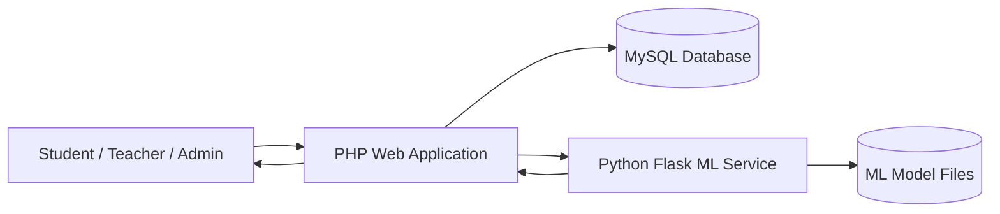
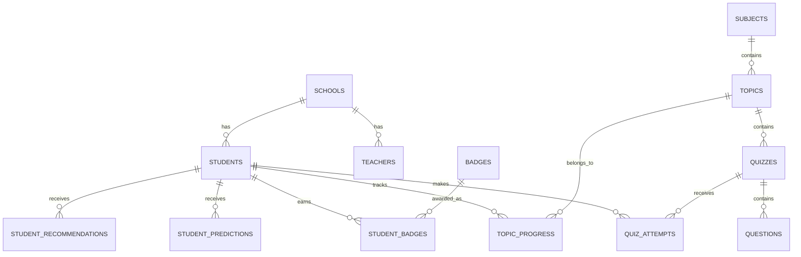
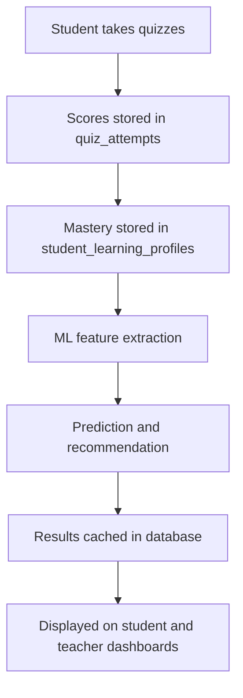

# EduTrack Ghana Defense Study Guide

Prepared for project defense on Tuesday, June 30, 2026.

## 1. Simple Project Summary

EduTrack Ghana is a web-based learning platform for Junior High School students in Ghana. It helps students study curriculum topics, take quizzes, track their progress, earn badges, receive personalized recommendations, and get support from teachers and administrators.

The system has three main users:

- Students learn topics, take quizzes, view progress, use accessibility tools, and receive recommendations.
- Teachers create lessons and quizzes, monitor students, send announcements, view analytics, and generate reports.
- Administrators manage students, teachers, subjects, topics, announcements, violations, and system logs.

The system was built with PHP, MySQL/MariaDB, HTML, CSS, JavaScript, and a Python Flask machine-learning service.

## 2. Problem the System Solves

Many schools need a better way to monitor learning progress, support students early, and help teachers make data-informed decisions. EduTrack solves this by combining digital learning, assessment, reporting, security, and machine learning in one platform.

The system answers these questions:

- What topics has a student completed?
- How well is a student performing in quizzes?
- Which topics should a student study next?
- Which students may need extra support?
- What can teachers report to parents or guardians?
- How can administrators monitor school activity and approve content?

## 3. Main Objectives

The main objectives of EduTrack are:

- Provide digital curriculum access for JHS learners.
- Allow students to take quizzes and receive instant feedback.
- Track student progress, scores, streaks, and badges.
- Help teachers monitor student performance.
- Generate reports for parents or guardians.
- Use machine learning to recommend topics and predict learning risk.
- Protect user data through authentication, authorization, CSRF protection, and database safeguards.

## 4. System Architecture

Explanation:

- The user interacts with the PHP web application through a browser.
- PHP handles login, pages, quizzes, reports, and database operations.
- MySQL stores users, topics, quizzes, scores, progress, logs, and ML results.
- Python Flask handles optional machine-learning services.
- If the ML service is down, PHP still provides fallback recommendations and predictions.

## 5. Main Code Folders

| Folder | Meaning |
|---|---|
| `auth/` | Login, registration, logout, sessions, CSRF, password validation. |
| `student/` | Student dashboard, subjects, topics, quizzes, progress, badges, accessibility. |
| `teacher/` | Teacher dashboard, quiz creation, reports, analytics, announcements. |
| `admin/` | Admin dashboard, teacher approval, student management, topics, logs, violations. |
| `api/` | JSON endpoints for ML, recent activity, and transcription. |
| `config/` | Database connection and application settings. |
| `includes/` | Shared layout and helper functions. |
| `ml/` | Machine-learning service, training scripts, and PHP fallback functions. |
| `database/` | Migrations, audit scripts, and demo seed data. |
| `docs/` | Documentation files. |

## 6. Important Functions to Understand

### Authentication Functions

| Function | Purpose |
|---|---|
| `isLoggedIn()` | Checks whether a user session exists. |
| `isStudent()` | Checks whether the current user is a student. |
| `isTeacher()` | Checks whether the current user is a teacher. |
| `isAdmin()` | Checks whether the current user is an admin. |
| `requireStudent()` | Blocks non-students from student pages. |
| `requireTeacher()` | Blocks non-teachers from teacher pages. |
| `requireAdmin()` | Blocks non-admins from admin pages. |
| `generateCSRF()` | Generates a secure form token. |
| `validateCSRF()` | Validates the form token before POST actions. |
| `loginUser()` | Verifies password, starts session, logs login. |
| `registerStudent()` | Validates and creates a student account. |
| `registerTeacher()` | Validates and creates a teacher account pending approval. |

### Student Learning Functions

| Function | Purpose |
|---|---|
| `getStudentStats()` | Loads dashboard statistics for a student. |
| `getSubjectsWithProgress()` | Shows subjects with completion percentage. |
| `getTopicsForSubject()` | Shows topics under a subject. |
| `startTopic()` | Starts tracking a topic. |
| `completeTopic()` | Marks a topic as completed and awards points. |
| `getAdaptiveQuizQuestions()` | Selects personalized questions for a learner. |
| `startQuizAttempt()` | Creates a quiz attempt record. |
| `submitQuizAttempt()` | Scores answers, saves results, awards points and badges. |
| `checkAndAwardBadges()` | Awards badges based on achievement rules. |

### Teacher Functions

| Function | Purpose |
|---|---|
| `getTeacherStats()` | Loads teacher dashboard statistics. |
| `getAllStudentsDetailed()` | Lists students with performance data. |
| `getStudentDetailForTeacher()` | Shows one student’s full learning record. |
| `getSchoolAnalytics()` | Shows school or subject analytics. |
| `generateStudentReport()` | Generates a report with scores, strengths, weaknesses, and ML forecast. |

### ML Functions

| Function | Purpose |
|---|---|
| `getStudentMLFeatures()` | Builds numeric learning features from quiz and progress data. |
| `predictStudentExamPerformance()` | Predicts future exam readiness or returns insufficient data. |
| `generateMLRecommendations()` | Recommends topics for a student to study. |
| `getNeuralLearnerProfile()` | Groups a student into a learning segment. |
| `callMLService()` | Sends requests from PHP to the Python Flask ML service. |

## 7. Database Explanation

The database is named `edutrack_ghana`.

It stores all users, curriculum content, quiz records, progress records, badges, logs, reports, and ML outputs.

### Main Database Tables

| Table | Purpose |
|---|---|
| `students` | Stores student accounts, class level, parent contact, points, streaks, and login data. |
| `teachers` | Stores teacher accounts, subject, school, approval status, and login data. |
| `admins` | Stores administrator accounts. |
| `schools` | Stores school names, regions, and districts. |
| `subjects` | Stores subjects such as Mathematics, English, Science, ICT, and others. |
| `topics` | Stores curriculum topics. |
| `quizzes` | Stores quiz information such as title, pass score, time limit, and attempts. |
| `questions` | Stores multiple-choice questions and correct answers. |
| `quiz_attempts` | Stores quiz scores, selected answers, and completed attempts. |
| `topic_progress` | Tracks whether a student has started or completed a topic. |
| `student_learning_profiles` | Stores mastery level per student and topic. |
| `badges` | Defines badges and award criteria. |
| `student_badges` | Stores badges earned by students. |
| `announcements` | Stores teacher/admin announcements. |
| `violation_reports` | Stores student violation reports. |
| `activity_logs` | Stores actions performed by users. |
| `login_logs` | Stores login activity. |
| `system_logs` | Stores admin system actions. |

### ML Database Tables

| Table | Purpose |
|---|---|
| `ml_model_metadata` | Stores model name, version, algorithm, features, metrics, and active status. |
| `student_predictions` | Stores predicted score, grade, confidence, risk level, and explanation factors. |
| `student_recommendations` | Stores recommended topics and recommendation scores. |
| `student_ml_profiles` | Stores learner segment such as developing, improving, or mastering. |
| `student_learning_goals` | Stores the student’s target mastery percentage. |
| `final_exam_results` | Stores verified final exam scores for future model training. |

## 8. Database Relationship Diagram

## 9. Security Features

Security was implemented in several layers.

### Authentication

Users must log in before accessing protected areas. Students, teachers, and admins have separate roles.

Example:

- Student pages use `requireStudent()`.
- Teacher pages use `requireTeacher()`.
- Admin pages use `requireAdmin()`.

### Password Hashing

Passwords are not stored as plain text. They are hashed using PHP password hashing functions.

Important functions:

- `password_hash()`
- `password_verify()`

### CSRF Protection

CSRF means Cross-Site Request Forgery. It is an attack where a user is tricked into submitting a form they did not intend to submit.

EduTrack protects forms using:

- `generateCSRF()`
- `validateCSRF()`

Each important POST request checks the CSRF token before changing data.

### SQL Injection Protection

The system uses prepared statements through PDO helpers:

- `dbQuery()`
- `dbRow()`
- `dbRows()`
- `dbInsert()`

This helps prevent attackers from injecting SQL through form inputs.

### Role-Based Access Control

Each user type can only access its own area:

- Students cannot access teacher or admin pages.
- Teachers cannot access admin pages.
- Teachers are restricted to students in their school.
- Admins manage the entire system.

### Output Escaping

The system uses `htmlspecialchars()` when displaying user-controlled text. This helps prevent Cross-Site Scripting attacks.

### File Upload Safety

Audio transcription accepts only allowed audio formats and limits file size to 15 MB.

### Audit Logs

Important actions are saved in logs:

- login
- logout
- registration
- quiz start
- quiz completion
- badge earned
- admin actions
- report email actions

## 10. Machine Learning Explanation

EduTrack uses ML to support learning decisions. The ML does not replace teacher judgment. It helps identify patterns and recommend learning actions.

The system uses the following ML-related features:

- Learner profiling
- Exam readiness prediction
- Topic recommendation
- Speech transcription for accessibility

## 11. ML Models Used

These are the model names to mention in your defense:

- Ridge Regression Model
- Personal Linear Trend Fallback Model
- XGBoost Prediction and Risk Model
- TensorFlow Learner Profile Model
- TensorFlow Contextual Bandit Recommendation Model
- Whisper Speech Transcription Model

### 1. Ridge Regression Model

Used for baseline exam performance prediction.

Meaning:

Ridge regression is a supervised learning algorithm that predicts a numeric value. In EduTrack, it predicts a future performance score from learning data such as quiz average, recent scores, mastery, and topic completion.

Where used:

- `ml/train_model.py`
- `ml/ml.php`

What it predicts:

- projected score
- BECE grade
- risk level
- confidence
- explanation factors

Defense sentence:

EduTrack uses a Ridge Regression Model as the baseline exam-readiness predictor.

### 2. Personal Linear Trend Fallback Model

Used as a fallback when there is not enough trained model support.

Meaning:

It looks at the student’s own score history and checks whether the learner is improving, declining, or stable.

Where used:

- `predictPersonalQuizTrend()` in `ml/ml.php`

Defense sentence:

EduTrack also has a Personal Linear Trend Fallback Model so the system can still estimate learning direction when the advanced ML service is unavailable.

### 3. XGBoost Prediction and Risk Model

Used for advanced score prediction and risk classification.

Meaning:

XGBoost is a gradient-boosted tree model. It learns patterns from many features and can predict a score or classify risk.

Where used:

- `ml/train_xgboost.py`
- `ml/ml_service.py`

Important defense point:

This model should be described as a prototype unless enough verified final exam results are collected.

Defense sentence:

EduTrack uses an XGBoost Prediction and Risk Model to estimate future performance and identify students who may need support.

### 4. TensorFlow Learner Profile Model

Used for learner profiling.

Meaning:

The autoencoder compresses student learning behavior into a small numeric representation. KMeans then groups learners into segments.

Segments include:

- `needs_support`
- `developing`
- `improving`
- `mastering`

Where used:

- `ml/train_learner_profile.py`
- `/api/v1/profile`

Defense sentence:

EduTrack uses a TensorFlow Learner Profile Model to group students into learning segments such as needs support, developing, improving, and mastering.

### 5. TensorFlow Contextual Bandit Recommendation Model

Used for topic recommendation.

Meaning:

A contextual bandit recommends the topic that is expected to give the best learning reward for the student. It considers the learner’s current performance and the topic characteristics.

Where used:

- `ml/train_bandit.py`
- `/api/v1/recommendations`

Defense sentence:

EduTrack uses a TensorFlow Contextual Bandit Recommendation Model to rank the best topics for each student to study next.

### 6. Whisper Speech Transcription Model

Used for accessibility.

Meaning:

Whisper converts student audio into text. This helps learners who prefer voice input or need accessibility support.

Where used:

- `student/accessibility.php`
- `api/transcribe.php`
- `ml/ml_service.py`

Important defense point:

The current Whisper model is a pretrained multilingual model. The project has a fine-tuning pipeline, but it should not be described as Ghanaian-accent fine-tuned unless a trained checkpoint and evaluation are available.

Defense sentence:

EduTrack uses a Whisper Speech Transcription Model for accessibility by converting recorded audio into text.

## 12. ML Data Flow

## 13. ML Features Explained

| Feature | Meaning |
|---|---|
| `attempt_count` | Number of completed quizzes. |
| `avg_score` | Average quiz score. |
| `recent_avg` | Average of recent quiz scores. |
| `trend` | Whether scores are improving or declining. |
| `pass_rate` | Percentage of quizzes passed. |
| `avg_time_minutes` | Average time used to complete quizzes. |
| `mastery` | Average topic mastery. |
| `topic_completion` | Percentage of curriculum completed. |
| `login_count_log` | Log-scaled platform activity. |
| `current_streak` | Current learning streak. |

## 14. ML Safety Measures

- The system does not give predictions to learners with insufficient data.
- Predictions are bounded between 0 and 100.
- Predictions include confidence and risk level.
- The system records model version and inference source.
- If Python Flask is offline, PHP fallback keeps the system working.
- The prediction is a planning estimate, not a final exam result.

## 15. Adaptive Quiz Selection

EduTrack does not simply give every student the same questions every time.

The function `getAdaptiveQuizQuestions()` selects questions using:

- student mastery level
- previous mistakes
- unseen questions
- difficulty level
- Bloom level
- attempt number

This helps personalize assessment.

## 16. Badge and Reward System

Students earn points and badges for learning actions.

Examples:

- completing topics
- passing quizzes
- getting perfect scores
- maintaining streaks
- earning high scores in subjects

The function `checkAndAwardBadges()` checks badge rules and awards new badges.

## 17. Reporting System

Teachers can generate reports that include:

- student profile
- quiz history
- subject averages
- strengths
- weaknesses
- badges
- attendance and conduct remarks
- ML forecast if enough evidence exists

Reports can also be emailed to parents or guardians.

## 18. What Makes the Project Strong

- It supports three user roles.
- It tracks real learning progress, not just login activity.
- It includes adaptive quizzes.
- It uses badges and streaks to motivate students.
- It includes teacher analytics and parent reports.
- It includes security protections.
- It includes ML but also has fallback logic.
- It is designed for Ghanaian JHS curriculum needs.

## 19. Limitations

Be honest about limitations during your defense:

- ML predictions need more verified final exam results for stronger validation.
- Whisper is currently pretrained, not fully fine-tuned for Ghanaian accents.
- The system is built for local XAMPP development; production deployment needs stronger server configuration.
- The SQL dump should not include real student data if shared.
- Internet or device limitations may affect accessibility features.

## 20. Future Improvements

Possible improvements:

- Deploy the system online with HTTPS.
- Collect more verified final exam results to improve ML accuracy.
- Fine-tune Whisper with consented Ghanaian-accent audio.
- Add SMS notifications for parents.
- Add more detailed teacher intervention tools.
- Add mobile app support.
- Add dashboards for school heads.
- Add more curriculum subjects and localized languages.

## 21. Likely Defense Questions and Answers

### Question 1: What is EduTrack Ghana?

EduTrack Ghana is a PHP and MySQL learning platform for Ghanaian Junior High Schools. It helps students learn topics, take quizzes, track progress, earn badges, and receive personalized recommendations. Teachers can monitor students and generate reports, while administrators manage users, topics, subjects, and system activity.

### Question 2: Why did you build this system?

I built it to help schools track student learning progress more effectively, support students who are struggling, and give teachers useful analytics for decision-making.

### Question 3: What technologies did you use?

The system uses PHP for the web application, MySQL/MariaDB for the database, HTML/CSS/JavaScript for the interface, and Python Flask for the machine-learning service.

### Question 4: What are the main modules?

The main modules are student, teacher, admin, authentication, database configuration, API, and machine learning.

### Question 5: How is the database structured?

The database has tables for users, schools, subjects, topics, quizzes, questions, quiz attempts, progress, badges, reports, logs, and ML outputs. Relationships connect students to schools, topics to subjects, quizzes to topics, questions to quizzes, and quiz attempts to students.

### Question 6: How do you protect user passwords?

Passwords are hashed using PHP password hashing functions. The system verifies passwords using `password_verify()` instead of comparing plain-text passwords.

### Question 7: How do you prevent SQL injection?

The system uses PDO prepared statements through helper functions like `dbQuery()`, `dbRow()`, and `dbInsert()`. User input is passed as parameters instead of being directly inserted into SQL.

### Question 8: What is CSRF protection?

CSRF protection prevents unauthorized form submissions. EduTrack generates a CSRF token and validates it before important POST actions such as login, registration, quiz submission, profile updates, and admin actions.

### Question 9: What machine learning is used?

The system uses a Ridge Regression Model for baseline prediction, an XGBoost Prediction and Risk Model for advanced performance forecasting, a TensorFlow Learner Profile Model for learner grouping, a TensorFlow Contextual Bandit Recommendation Model for topic ranking, and a Whisper Speech Transcription Model for accessibility.

### Question 10: What does the prediction model predict?

It predicts a student’s future exam readiness score, BECE grade, confidence, and risk level based on quiz performance, mastery, topic completion, streak, and platform activity.

### Question 11: Is the ML prediction a final result?

No. It is only a planning estimate. It helps teachers and students identify risk early, but it does not replace official exams or teacher judgment.

### Question 12: What happens if the ML service is offline?

The PHP application still works. EduTrack has fallback logic in `ml/ml.php` that can still provide basic predictions and recommendations.

### Question 13: How does the recommendation system work?

It recommends topics based on mastery gaps, quiz performance, topic progress, learning goal, difficulty fit, and risk level. If the advanced ML model is available, it ranks topics using a contextual bandit model.

### Question 14: How does adaptive quiz selection work?

The system selects questions based on the learner’s mastery, previous mistakes, unseen questions, difficulty, Bloom level, and attempt number.

### Question 15: What are the user roles?

The user roles are student, teacher, and administrator. Each role has different permissions and pages.

### Question 16: How do teachers use the system?

Teachers can view student performance, create topics and quizzes, send announcements, analyze student progress, view student details, and generate reports for parents.

### Question 17: How do administrators use the system?

Administrators approve teachers, manage students, manage subjects, approve or reject topics, manage announcements, review violation reports, and view system logs.

### Question 18: What is the strongest part of your project?

The strongest part is that it combines learning management, assessment, reporting, security, and machine learning in one system while still allowing the core learning features to work even if ML is unavailable.

### Question 19: What would you improve later?

I would improve deployment security, collect more verified exam labels for stronger ML validation, fine-tune speech recognition with consented Ghanaian-accent audio, and add parent SMS notifications.

### Question 20: What did you learn from the project?

I learned how to design a full web system with multiple user roles, connect PHP to MySQL, implement secure authentication, track learning data, design database relationships, and integrate machine learning into a real education workflow.

## 22. Short Defense Speech

Good day. My project is called EduTrack Ghana. It is a web-based learning platform designed for Ghanaian Junior High Schools. The system supports three main users: students, teachers, and administrators.

Students can study curriculum topics, take quizzes, view their progress, earn badges, and receive personalized topic recommendations. Teachers can monitor student performance, create quizzes, send announcements, view analytics, and generate reports for parents. Administrators can manage users, subjects, topics, violations, announcements, and system logs.

The system was developed using PHP, MySQL, HTML, CSS, JavaScript, and Python Flask. The database stores user records, curriculum topics, quizzes, questions, quiz attempts, progress, badges, logs, reports, and machine-learning outputs.

Security was an important part of the system. Passwords are hashed, pages are protected by role-based access control, forms use CSRF tokens, SQL queries use prepared statements, and user output is escaped to reduce cross-site scripting risks.

The system also includes machine learning. It uses student quiz and progress data to generate exam-readiness forecasts, learner profiles, and study recommendations. The ML service is optional, so if the Python service is offline, the PHP system still continues to work using fallback logic.

In conclusion, EduTrack Ghana helps students learn better, helps teachers monitor performance, and helps schools make better decisions using secure data and intelligent recommendations.

## 23. Key Points to Memorize

- EduTrack has three roles: student, teacher, admin.
- PHP handles the main web system.
- MySQL stores all system data.
- Flask handles optional ML services.
- Security includes password hashing, CSRF protection, role checks, prepared statements, and output escaping.
- ML supports prediction, recommendation, learner profiling, and transcription.
- Predictions are planning estimates, not final exam results.
- The system still works if ML is offline.
