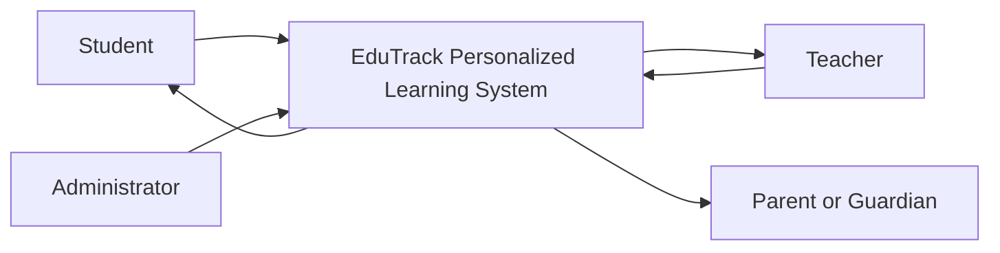
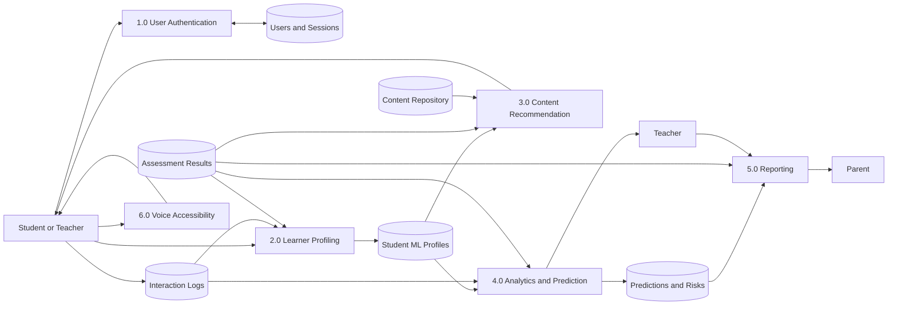

# EduTrack ML Data Flow and Implementation

## Context diagram

## Level 1 DFD

## Process mapping

| DFD process | Implementation | Model or method | Status |
|---|---|---|---|
| 1.0 Authentication | `auth/auth.php` | Password hashing, CSRF, role sessions | Operational |
| 2.0 Learner Profiling | `ml/train_learner_profile.py`, `/api/v1/profile` | TensorFlow dense autoencoder with four-dimensional embeddings and K-means segments | Operational prototype |
| 3.0 Recommendation | `ml/train_bandit.py`, `/api/v1/recommendations` | TensorFlow offline contextual-bandit reward model | Operational prototype |
| 4.0 Prediction | `ml/train_xgboost.py`, `/api/v1/predict` | XGBoost regression and risk classification | Operational prototype; no verified exam labels yet |
| 5.0 Reporting | `teacher/reports.php`, `teacher/report_email_template.php` | Automated progress and forecast reports forwarded by email | Operational |
| 6.0 Accessibility | `student/accessibility.php`, `/api/v1/transcribe` | OpenAI multilingual Whisper base | Operational pretrained baseline; not Ghanaian-accent fine-tuned |

## Data stores

- **Student Profiles:** `student_learning_profiles`, `student_ml_profiles`, and student preference fields.
- **Content Repository:** subjects, topics, quizzes, and reviewed questions.
- **Interaction Logs:** `activity_logs`, `login_logs`, topic progress, and quiz attempts.
- **Predictions:** `student_predictions`, `student_recommendations`, and model metadata.
- **Verified Outcomes:** `final_exam_results` for future supervised model validation.

## Model evidence

- TensorFlow learner profiler: 239 interaction samples; reconstruction MSE and silhouette score are stored with the artifact.
- TensorFlow contextual bandit: 239 events; group-separated test MAE and RMSE are stored with the artifact.
- XGBoost: 203 temporal samples, split by student; no verified final-exam labels currently exist. It must be described as an exam-readiness prototype.
- Whisper: multilingual base weights are installed and transcription is operational. Fine-tuning requires a consented manifest with at least 500 recordings from at least 20 speakers, split by speaker.

## Rural inclusion

The Flask API runs locally, PHP retains model fallbacks, and the main learning workflow remains usable if the model service is unavailable. Interfaces are responsive and avoid requiring continuous cloud inference. Whisper transcription is local after model installation, but microphone access and device capability still affect availability.
